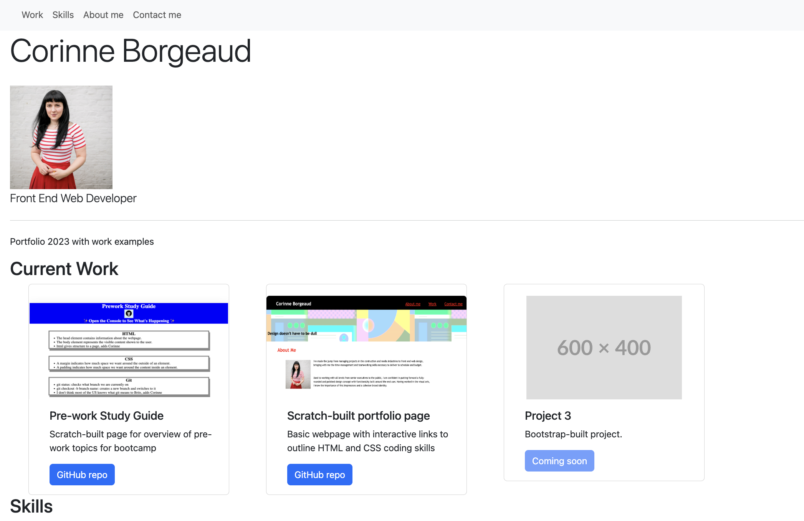

Bootstrap-Portfolio

# Module 3 challenge restyle of portfolio using Bootstrap components and CSS

This webpage with interactive links was created for the third challenge of the EdX Front End Web Development bootcamp to demonstrate how common Bootstrap 5.3 components can be used alongside custom CSS. Outline starter code was modified to make a simple portfolio page with examples of coding work and contact details for a developer in training.

## Description

Portfolios are a key part of applying for work as a developer and images of deployed apps, along with links to their repositories on GitHub are what employers will be looking for. A section for contact details with interactive links, and nav elements in the header of a page are basic features that help your portfolio page stand out.

## Installation

N/A

## Usage

https://github.com/SpecialFriendRice/wk2challenge-portfolio

https://specialfriendrice.github.io/wk2challenge-portfolio/

## Credits

Uses Bootstrap components including Navbar, Jumbotron and Cards (as specified in Challenge requirements) and accompanying CSS.

## License

MIT Licence, as outlined in the Github repository.
